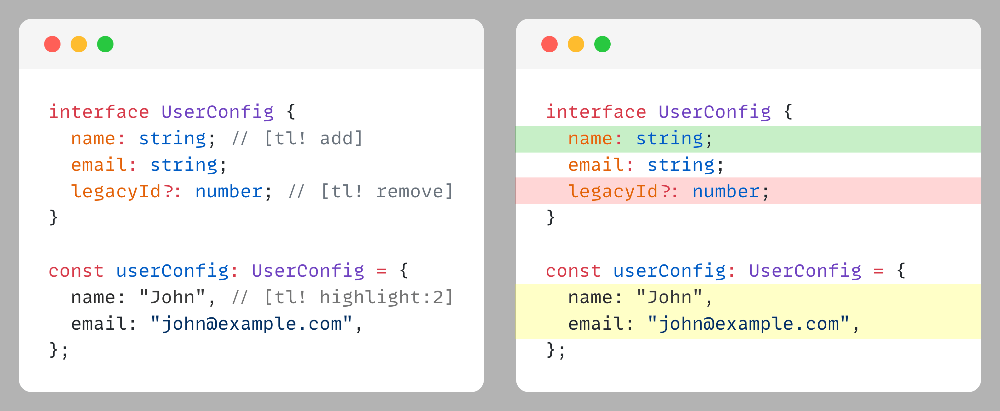
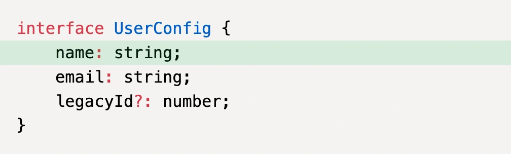
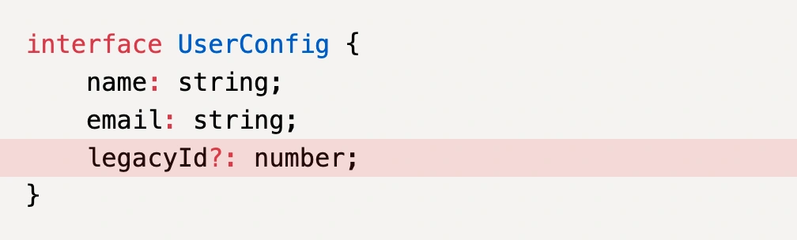
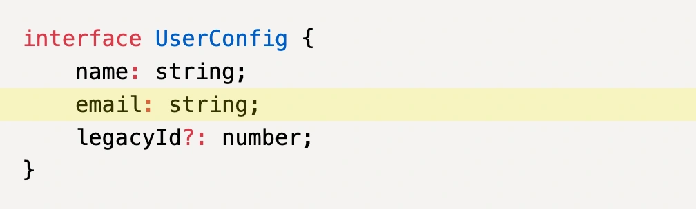
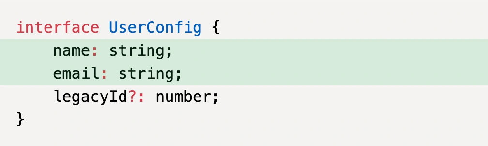
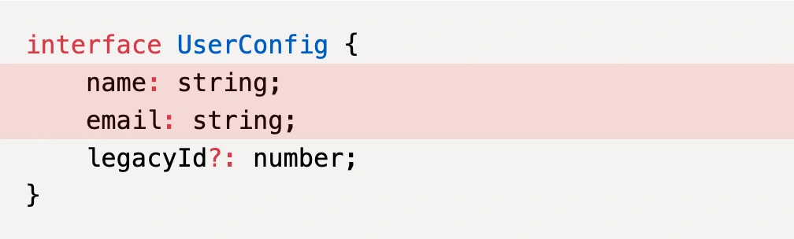
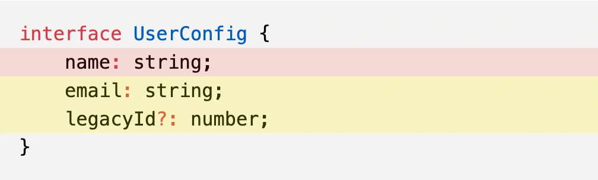
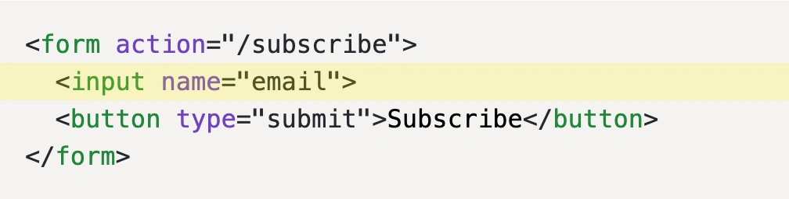
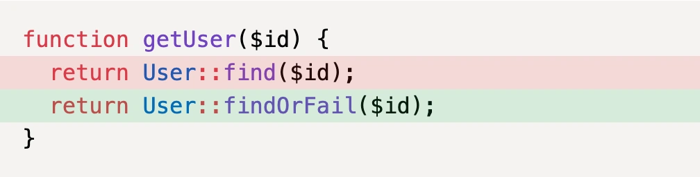
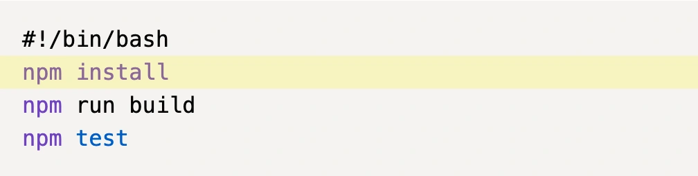

# Prism Highlight Lines Plugin

## Highlight code snippets lines using comments



<ul>
  <li>
    <a href="https://www.npmjs.com/package/prism-highlight-lines-plugin">
      NPM
    </a>
  </li>
  <li>
    <a href="https://github.com/nicodevs/prism-highlight-lines-plugin">
      GitHub
    </a>
  </li>
</ul>

---

## Installation

Install with your favorite package manager:

```bash
npm install prism-highlight-lines-plugin
```

Then, import the plugin after importing Prism.

```javascript
import Prism from 'prismjs';

import 'prism-highlight-lines-plugin';
import 'prism-highlight-lines-plugin/src/style.css';
```

## Alternative: CDN

```html
<!-- Prism Core -->
<link rel="stylesheet" href="https://cdn.jsdelivr.net/npm/prismjs@1/themes/prism.min.css">
<script src="https://cdn.jsdelivr.net/npm/prismjs@1/prism.min.js"></script>

<!-- Add language components as needed -->
<script src="https://cdn.jsdelivr.net/npm/prismjs@1/components/prism-javascript.min.js"></script>

<!-- Prism Highlight Lines Plugin -->
<link rel="stylesheet" href="https://cdn.jsdelivr.net/npm/prism-highlight-lines-plugin@latest/src/style.css">
<script src="https://cdn.jsdelivr.net/npm/prism-highlight-lines-plugin@latest/dist/index.min.js"></script>
```

---

## Usage

This plugin lets you highlight lines in your code snippets using comments with special annotations.

All annotations start with `[tl!` and end with `]`.

There are 3 types: `highlight`, `add` and `remove`.

### Examples

**Example 1: Add**

| Code | Result |
|------|--------|
| <pre>interface UserConfig {<br>    name: string; // [tl! add]<br>    email: string;<br>    legacyId?: number;<br>}</pre> |  |

**Example 2: Remove**

| Code | Result |
|------|--------|
| <pre>interface UserConfig {<br>    name: string;<br>    email: string;<br>    legacyId?: number; // [tl! remove]<br>}</pre> |  |

**Example 3: Highlight**

| Code | Result |
|------|--------|
| <pre>interface UserConfig {<br>    name: string;<br>    email: string; // [tl! highlight]<br>    legacyId?: number;<br>}</pre> |  |

---

## Ranges

You can highlight multiple lines using a `:` and an integer to specify how many lines to highlight.

### Examples

**Example 1: Range**

| Code | Result |
|------|--------|
| <pre>interface UserConfig {<br>    name: string; // [tl! add:2]<br>    email: string;<br>    legacyId?: number;<br>}</pre> |  |

**Example 2: Negative range**

| Code | Result |
|------|--------|
| <pre>interface UserConfig {<br>    name: string;<br>    email: string;<br>    legacyId?: number; // [tl! remove:-2]<br>}</pre> |  |

**Example 3: Multiple Ranges**

| Code | Result |
|------|--------|
| <pre>interface UserConfig {<br>    name: string;<br>    email: string; // [tl! highlight:2 remove:-1]<br>    legacyId?: number;<br>}</pre> |  |

---

## Languages

Works with all Prism.js supported languages including:

- JavaScript, TypeScript, Java, C, C++, C#, PHP, Go, Rust, Swift, Kotlin, Dart
- Python, Ruby, Perl, Bash, Shell, PowerShell, YAML, R
- Lua, Haskell, Elm, Lisp, Clojure, Scheme
- MATLAB, TeX, LaTeX
- CSS, SCSS, Sass, Less, SQL
- HTML, XML, Blade templates

### Examples

**Example 1: HTML**

| Code | Result |
|------|--------|
| <pre>&lt;form action="/subscribe"&gt;<br>  &lt;input name="email"&gt; &lt;!-- [tl! highlight] --&gt;<br>  &lt;button type="submit"&gt;Subscribe&lt;/button&gt;<br>&lt;/form&gt;</pre> |  |

**Example 2: PHP**

| Code | Result |
|------|--------|
| <pre>function getUser($id) {<br>  return User::find($id); // [tl! remove]<br>  return User::findOrFail($id); // [tl! add]<br>}</pre> |  |

**Example 3: Bash**

| Code | Result |
|------|--------|
| <pre>#!/bin/bash<br>npm install # [tl! highlight]<br>npm run build<br>npm test</pre> |  |

---

## Browser Support

Works in all modern browsers that support:

- ES6+
- MutationObserver
- Prism.js

## License

MIT

## Author

[Nico Devs](https://nicodevs.com)
